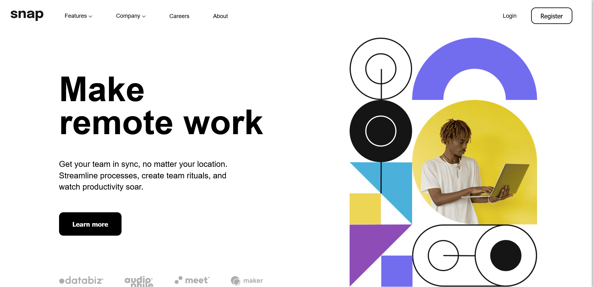

# Frontend Mentor - Intro section with dropdown navigation solution

This is a solution to the [Intro section with dropdown navigation challenge on Frontend Mentor](https://www.frontendmentor.io/challenges/intro-section-with-dropdown-navigation-ryaPetHE5). Frontend Mentor challenges help you improve your coding skills by building realistic projects. 

## Table of contents

- [Overview](#overview)
  - [The challenge](#the-challenge)
  - [Screenshot](#screenshot)
  - [Links](#links)
- [My process](#my-process)
  - [Built with](#built-with)
  - [What I learned](#what-i-learned)
  - [Continued development](#continued-development)
  - [Useful resources](#useful-resources)
- [Author](#author)
- [Acknowledgments](#acknowledgments)

## Overview

### The challenge

Users should be able to:

- View the relevant dropdown menus on desktop and mobile when interacting with the navigation links
- View the optimal layout for the content depending on their device's screen size
- See hover states for all interactive elements on the page

### Screenshot



### Links

- Live Site URL: [Add live site URL here](https://your-live-site-url.com)

## My process

### Built with

- Semantic HTML5 markup
- CSS custom properties
- Flexbox
- Vanilla JavaScript

### What I learned

#### Designing a Responsive Menu Bar

I designed a flexible navbar that adjusts its layout based on the screen size. On larger screens, it displays as a traditional horizontal menu, while on smaller screens, it transforms into a sidebar.

```css
.nav {
  z-index: 1000;
  padding: 0.7rem;
  padding-bottom: 0;
  position: relative;
  display: flex;
  align-items: center;
  justify-content: space-between;
}

.sidebar {
  display: none;
  position: fixed;
  top: 0;
  right: -70%;
  width: 70%;
  height: 100%;
  background-color: #fff;
  box-shadow: -2px 0 5px rgba(0, 0, 0, 0.5);
  transition: right 0.3s ease;
  z-index: 1000;
  flex-direction: column;
  justify-content: flex-start;
  padding: 1rem;
  overflow-y: auto;
}

.sidebar.active {
  right: 0;
}

.hamburger {
  display: none;
  z-index: 1002;
  position: absolute;
  top: 1rem;
  right: 1.5rem;
  cursor: pointer;
}

.close {
  display: none;
  position: absolute;
  top: 0;
  right: 0;
  cursor: pointer;
  z-index: 1002;
}

@media (max-width: 875px) {
  .hamburger {
    display: block;
  }

  .sidebar .logo,
  .menu-items,
  .signup {
    display: none;
  }

  .sidebar.active .hamburger {
    display: none;
  }

  .sidebar.active .close {
    display: block;
  }
}
```

#### Toggling Arrows for Dropdown Menus

Utilized CSS and JavaScript to toggle arrow indicators for dropdown menus, enhancing the user experience.

```css
.dropdown-menu {
  position: absolute;
  top: 100%;
  left: 90px;
  background: #fff;
  box-shadow: rgba(42, 42, 44, 0.2) 0px 7px 40px 0px;
  padding: 0.7rem 0.5rem;
  border-radius: 0.7rem;
  display: none;
}

.dropdown-menu.active {
  display: block;
}

.hidden {
  display: none;
}

.features-dropdown.active .features-arrow-up,
.company-dropdown.active .company-arrow-up {
  display: inline;
}

.features-dropdown:not(.active) .features-arrow-down,
.company-dropdown:not(.active) .company-arrow-down {
  display: inline;
}

.features-dropdown.active .features-arrow-down,
.company-dropdown.active .company-arrow-down {
  display: none;
}
```

```javascript
document.addEventListener("DOMContentLoaded", function() {
  const sidebar = document.querySelector(".sidebar");
  const overlay = document.querySelector(".overlay");
  const hamburger = document.querySelector(".hamburger");
  const closeBtn = document.querySelector(".close");

  function toggleSidebar() {
    sidebar.classList.toggle("active");
    overlay.classList.toggle("active");
  }

  hamburger.addEventListener("click", toggleSidebar);
  closeBtn.addEventListener("click", toggleSidebar);
  overlay.addEventListener("click", toggleSidebar);

  const featuresDropdown = document.querySelector(".features-dropdown");
  const companyDropdown = document.querySelector(".company-dropdown");

  function toggleDropdown(dropdown) {
    dropdown.classList.toggle("active");
  }

  featuresDropdown.addEventListener("click", function() {
    toggleDropdown(featuresDropdown);
  });

  companyDropdown.addEventListener("click", function() {
    toggleDropdown(companyDropdown);
  });

  document.addEventListener("click", function(event) {
    if (!featuresDropdown.contains(event.target)) {
      featuresDropdown.classList.remove("active");
    }
    if (!companyDropdown.contains(event.target)) {
      companyDropdown.classList.remove("active");
    }
  });

  featuresDropdown.addEventListener("click", function(event) {
    event.stopPropagation();
  });

  companyDropdown.addEventListener("click", function(event) {
    event.stopPropagation();
  });
});
```

#### Responsive Images

Used media queries to adjust the background image based on screen size, ensuring a consistent and responsive design.

```css
.img {
  background-image: url(images/image-hero-desktop.png);
  background-size: contain;
  background-repeat: no-repeat;
  background-position: center;
  margin-right: 5%;
  margin-left: 2%;
  padding: 10.5rem 15rem;
  aspect-ratio: 3/4;
}

@media (max-width: 875px) {
  .img {
    margin: 0;
    padding: 0;
    background-image: url(images/image-hero-mobile.png);
    background-size: contain;
    background-position: center;
    width: 100%;
    height: 80vw;
  }
}
```

#### CSS `clamp()` Property

Applied the `clamp()` property to ensure that text scales smoothly between defined minimum and maximum sizes, improving readability on different devices.

```css
h1 {
  font-size: clamp(2rem, 10vw, 8rem); /* Responsive font size */
  display: flex;
  justify-content: center;
  margin: auto;
  align-items: center;
  flex-direction: row;
  width: 100%;
  white-space: nowrap; /* Prevent text wrapping */
  padding: 0;
  line-height: 1.2;
}
```

#### JavaScript Initializations

I also learned about using JavaScript initializations effectively to manage the state and behavior of interactive elements in the project.

### Continued development

In future projects, I want to focus on:

- Enhancing accessibility features for dropdown menus and other interactive elements.
- Exploring more advanced CSS techniques for animations and transitions.
- Integrating more complex JavaScript functionalities to improve user interactions.

### Useful resources

- [CSS Tricks - A Complete Guide to Flexbox](https://css-tricks.com/snippets/css/a-guide-to-flexbox/) - This helped me understand Flexbox better.
- [MDN Web Docs - clamp()](https://developer.mozilla.org/en-US/docs/Web/CSS/clamp) - A great resource for understanding and using the `clamp()` property.
- [ChatGPT by OpenAI](https://www.openai.com/) - Provided invaluable assistance and guidance throughout the project.

## Author

- Website - [Your Name](https://www.your-site.com)
- Frontend Mentor - [@yourusername](https://www.frontendmentor.io/profile/yourusername)
- Twitter - [@yourusername](https://www.twitter.com/yourusername)

## Acknowledgments

Special thanks to ChatGPT by OpenAI for providing invaluable assistance and guidance.
